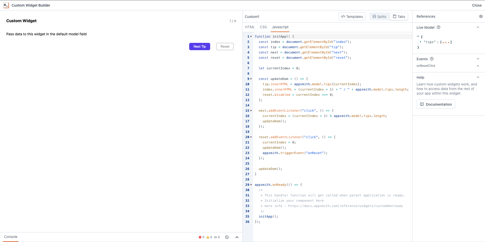
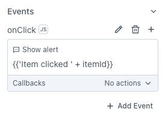

# Custom

https://docs.appsmith.com/reference/widgets/custom#content-properties

Хоча Appsmith надає великий набір вбудованих віджетів для розробки додатків, є випадки, коли для вашого проекту потрібен віджет, адаптований до конкретних вимог. Спеціальний віджет Appsmith дозволяє вам інтегрувати унікальні функції з кодом HTML, CSS і JavaScript для отримання додаткових функцій.

See [How to create Custom widgets](https://docs.appsmith.com/build-apps/how-to-guides/Create-Custom-Widgets-Using-Iframe).

## Content properties

Ці властивості є настроюваними параметрами, присутніми на панелі властивостей віджета, що дозволяє користувачам змінювати віджет відповідно до своїх уподобань.

### Widget

#### Edit Source

Дозволяє налаштувати код для спеціального віджета. Після натискання відкривається спеціальна сторінка, де ви можете зручно змінити та оновити код віджета відповідно до ваших вимог.

Дізнайтеся більше про [Custom Widget Builder](https://docs.appsmith.com/reference/widgets/custom#custom-widget-builder).

#### Default Model

Ця властивість дозволяє передавати дані об’єкта до редактора коду спеціального віджета. Ви можете використовувати прив’язку `{{}}` для передачі даних із запитів або інших віджетів.

*Приклад:* Якщо ви хочете передати ім’я з віджета Table  в настроюваний віджет, скористайтеся таким кодом:

```js
{
  "name": "{{Table1.selectedRow.name}}"
}
```

- Щоб отримати доступ до даних у редакторі JavaScript на сторінці конструктора спеціальних віджетів, використовуйте `appsmith.model.{property-name}`.

- Щоб отримати доступ до даних у редакторі CSS на сторінці конструктора спеціальних віджетів, використовуйте `var(--appsmith-model-{property-name}`

### General

#### Visible `boolean`

Керує видимістю віджета. Якщо вимкнути цю властивість, віджет не буде видно в режимі перегляду. Крім того, ви можете використовувати JavaScript, натиснувши **JS** поруч із властивістю **Visible**, щоб контролювати видимість віджета відповідно до умови. Значенням властивості за замовчуванням є `true`.

Наприклад, якщо ви хочете зробити віджет видимим лише тоді, коли користувач вибирає  "Yes" у віджеті Select1, ви можете використати такий вираз JavaScript:

```js
{
  {
    Select1.selectedOptionValue === "Yes";
  }
}
```

#### Height `string`

Ця властивість визначає, як висота віджета пристосовується до змін у його вмісті. Доступні три варіанти:

- **Fixed**: висота віджета залишається незмінною за допомогою перетягування та зміни розміру.
- **Auto Height**: висота віджета динамічно регулюється відповідно до змін у його вмісті.
- **Auto Height with limits**: те саме, що **Auto height**, з настроюваною опцією для встановлення мінімальної та максимальної кількості рядків, які може займати віджет.

УВАГА

- Щоб функція автоматичної висоти працювала належним чином, ви не повинні встановлювати висоту контейнера спеціального віджета в редакторі джерел. Встановлення висоти обмежить зростання контейнера, тому функція автоматичного визначення висоти не працюватиме.

### Events

Дозволяє створювати кілька подій, забезпечуючи гнучкість налаштування різних дій відповідно до ваших конкретних вимог, наприклад функцій Framework, запитів або функцій JavaScript.

Ці події можна ініціювати в редакторі коду JavaScript спеціального віджета за допомогою `appsmith.triggerEvent("eventName")`.

*Приклад*: щоб ініціювати подію зі спеціального віджета після натискання кнопки, створіть нову подію під назвою **onResetClick** і додайте таке в код JavaScript:

```js
const handleReset = () => {
  setCurrentIndex(0);
  appsmith.triggerEvent("onResetClick");
};
```

*Left: Custom Widget Builder | Right: Widget Events*

## Reference properties

Довідкові властивості – це властивості, які недоступні на панелі властивостей, але доступ до яких можна отримати за допомогою оператора крапки в інших віджетах або функціях JavaScript. Вони надають додаткову інформацію або дозволяють програмно взаємодіяти з віджетом. Наприклад, щоб отримати статус видимості, ви можете використовувати `Custom1.isVisible`.

#### model `string`

Властивість `model` отримує значення зі спеціального віджета та властивості **Default Model**.

*Приклад*:

```js
{{Custom1.model}}

// Accessing a specific property
{{Custom1.model.signatureImage}}
```

#### isVisible `boolean`

The `isVisible` property indicates the visibility state of a widget, with true indicating it is visible and false indicating it is hidden.

*Example*:

```js
{{ Custom1.isVisible }}
```

## Custom Widget Builder

Цей розділ, який можна відкрити, натиснувши кнопку редагування джерела на панелі властивостей спеціального віджета, містить Редактор коду спеціального віджета, який дозволяє редагувати код HTML, JS і CSS для ваших спеціальних віджетів.

*Custom Widget Builder*

- Створюючи власний компонент, пропускайте теги `<html>` і `<body>`. Замість цього додайте лише важливі теги безпосередньо у свій HTML-код.
- Під час імпорту бібліотек вибирайте метод ESM (модуль ECMAScript) або UMD (універсальне визначення модуля). Використовуйте надійних постачальників CDN, як-от [jsDelivr](https://www.jsdelivr.com/) або [UNPKG](https://unpkg.com/) для імпорту бібліотек.

### Javascript API

Ці властивості доступні в редакторі JavaScript, надаючи певні функції та параметри налаштування.

#### model `object`

Властивість `model` отримує значення, передане властивістю **Default Model** спеціального віджета.

```js
// Access the entire model
appsmith.model;

// Access a specific property in the model
appsmith.model.propertyname;
```

#### mode `string`

The `mode` property represents the current render context of the Custom widget.

```js
appsmith.mode;

// Value: EDITOR | BUILDER | DEPLOYED
```

#### theme `object`

Об’єкт `theme` відображає поточну тему програми Appsmith.

- `primaryColor` (`string`): Represents the primary color of the application theme.
- `backgroundColor` (`string`): Represents the background color of the application theme.
- `borderRadius` (`string`): Specifies the border radius used in the application theme.
- `boxShadow` (`string`): Represents the box shadow applied in the application theme.

```js
appsmith.theme;
```

#### ui `object`

Надає доступ до елементів інтерфейсу користувача віджета, таких як ширина та висота, у пікселях.

```js
appsmith.ui;
```

### Methods

#### updateModel

Властивість `updateModel` дозволяє динамічно оновлювати властивості моделі. Це забезпечує синхронізацію в реальному часі між користувацьким віджетом і батьківською програмою. 

*Приклад*: якщо ви хочете зберегти підпис із спеціального віджета Signature pad, після натискання кнопки використовуйте такий код:

```js
document.getElementById("saveBtn").addEventListener("click", function () {
  var dataURL = signaturePad.toDataURL();
  // Implement logic to save the signature data (e.g., send to server)
  appsmith.updateModel({ signatureImage: dataURL });
});
```

Після натискання кнопки дані панелі для підпису стануть доступними у властивості моделі спеціального віджета. ви можете використовувати ці дані в іншому віджеті за допомогою прив’язки `{{}}`.

*Приклад*: ви можете прив’язати дані панелі підпису до віджета зображення, вставивши наступний код у властивість `image` віджета зображення на панелі властивостей.

```js
{{ Custom1.model.signatureImage }}
```

#### triggerEvent

Ви можете виконувати спеціальні події, які ви створили на панелі властивостей спеціального віджета, викликавши цю функцію з назвою події. Ви також можете використати деякі додаткові дані, передавши другий аргумент.

*Приклад*: припустімо, у вашому спеціальному компоненті є кнопки, після натискання яких ви хочете активувати подію onClick уздовж itemId

```js
function onClick() {
  appsmith.triggerEvent("onClick", { itemId: 1 });
}
```



*Custom Widget custom event: onClick*

#### onModelChange

Функція `onModelChange` дозволяє зареєструвати функцію-обробник, яка буде викликатися щоразу, коли відбувається зміна в моделі або з платформи, або з іншої частини спеціального віджета (див. функцію `updateModel`).

*Example*:

```js
  const unlisten = appsmith.onModelChange((model) => {
    setSelectedItem(model.selectedItem);
  });

  // Unsubscribe when no longer interested in updates.  
  unlisten();
```

Коли ви більше не зацікавлені в прослуховуванні зміни моделі, викличте значення, що повертається функцією `appsmith.onModelChange`.

#### onUiChange

Дозволяє викликати функцію обробки щоразу, коли змінюється інтерфейс користувача, тобто ширина, висота, надаючи корисний механізм для оновлення компонентів, на які впливають зміни інтерфейсу користувача з платформи.

```js
  const unlisten = appsmith.onUiChange((ui) => {
    setComponentWidth(ui.width);
  });

  // Unsubscribe when no longer interested in updates.  
  unlisten();
```

#### onReady

Подія **onReady** в Appsmith — це механізм очікування завершення ініціалізації батьківської програми перед виконанням спеціальної логіки віджетів. Використовуйте `appsmith.onReady`, щоб передати функцію обробки. Цей обробник викликається, коли батьківська програма готова, і ви повинні почати рендеринг вашого компонента з цього обробника.

```js
appsmith.onReady(() => {
  /* you need to initiate the component here, for example,
   * if you have a react component - call reactDom.render here
   * if you have vanila JS component - call the contructor or initiate here
   */
});
```

УВАГА

- Ініціалізація вашого компонента всередині функції обробки onReady є дуже важливою, оскільки вона гарантує, що батьківська програма готова спілкуватися з вашим спеціальним компонентом перед ініціалізацією.

#### onThemeChange

Підпишіться на зміни теми та виконайте функцію зворотного виклику.

```js
// Set the primaryColor of your component using a function.
const unlisten = appsmith.onThemeChange((theme, oldTheme) => {
  setPrimaryColor(theme.primaryColor);
});

// Unsubscribe when no longer interested in updates.
unlisten();
```

### CSS API

Ці змінні CSS доступні в редакторі CSS, пропонують певні функції та параметри налаштування. Змінні поділяються на три групи: змінні моделі, змінні інтерфейсу користувача та змінні теми. Appsmith оновлює значення цих властивостей, коли змінюється відповідне джерело.

#### model

Властивість `model` отримує значення, передане властивістю **Default Model** спеціального віджета. Appsmith автоматично генерує відповідні змінні CSS для кожної властивості рядка та числа у вашій моделі. Ця функція є корисною для передачі конфігурацій CSS, таких як ширина або колір, через вашу модель.

```js
/* CSS Variable Naming Convention: --appsmith-model-<property-name> */

// For instance, with the following Default Model:
{
	"mainColor": "#000",
	"borderWidth": "1px"
}

// Appsmith automatically creates the corresponding variables:
--appsmith-model-mainColor
--appsmith-model-borderWidth

// Utilize them as follows:
button {
	background-color: var(--appsmith-model-mainColor);
	border: var(--appsmith-model-borderWidth) solid var(--appsmith-model-mainColor);
}
```

#### UI and theme

These CSS variables, available to control widget size and define the theme:

- `ui`: representing the height and width of the widget in pixels.
- `theme`: representing the selected theme of your application.

```js
//Widget size
--appsmith-ui-width;
--appsmith-ui-height;

//Application theme
--appsmith-theme-primaryColor;
--appsmith-theme-backgroundColor;
--appsmith-theme-borderRadius;
--appsmith-theme-boxShadow;
```

info

`--appsmith-ui-width` and `--appsmith-ui-height` are number types, to convert them to px, you can use

```
calc(var(--appsmith-ui-width) * 1px)
```